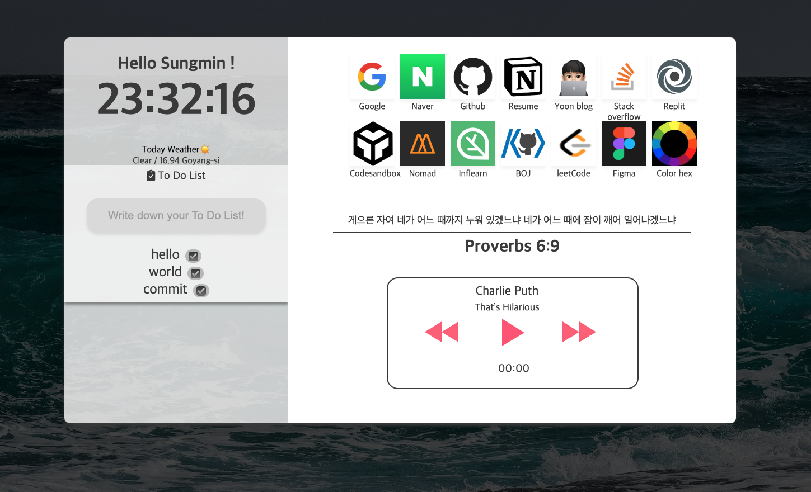

# ToDoList_WEB
### ✔Project Page: [Check To do!](https://todolistweb.y00nmin.repl.co/)  

## ✨ver. 1.0.0  

  
#### ⬆기본 메인 화면입니다!
   
#### ⬆로그인 및 List 추가된 화면입니다.!
 🤗순수 바닐라 자바스크립트만을 이용해 간단한 To Do List Page를 만들었습니다!  
>[노마드 코더](https://nomadcoders.co/javascript-for-beginners/lobby)님의 바닐라 자바스크립트를 이용한 크롬 앱만 만들기 강의를 이용해 만들어 졌습니다.

## ✨ver. 2.0.0
기능 추가( 바로가기, 이미지, 랜덤 인용구 표시, 투두리스트, 현 지역 날씨, 시계, 로그인 기능)

#### ⬆ver.2 메인 화면입니다!

